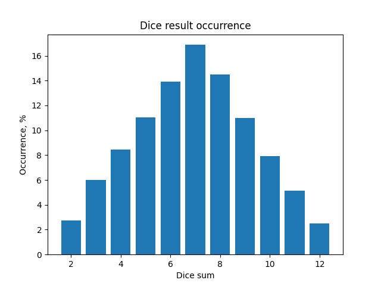

# Algorithm course final project 

Table of Contents
1. [Linked lists](#1-linked-lists)
2. [Build Pythagoras Tree using recursion](#2-build-pythagoras-tree-using-recursion)
3. [Dijkstra with heap](#3-dijkstra-with-heap)
4. [Heap visualisation](#4-heap-visualisation)
5. [DFS & BFS visualisation](#5-dfs--bfs-visualisation)
6. [Greedy Algorithm](#6-greedy-and-dp-algorithms)
7. [Monte Carlo](#7-monte-carlo)

## 1. Linked lists

Added the following functions:
* Reverse linked list, [link](01/linked_list.py#L65)
* Sort list (insertion sort), [link](01/linked_list.py#L75)
* Merge and sort linked lists, [link](01/linked_list.py#L85)

Tests can be found [here](01/tests.py)

## 2. Build Pythagoras Tree using recursion

Code on [02/pythagoras_tree.py](02/pythagoras_tree.py) draws a fractal Pythagoras Tree using the Turtle library. 

Users have the ability to set the complexity of drawing using the command line prompt. 

### Requirements

Python 3, below 3.9.

### Usage

Launch:
```
python3 02/pythagoras_tree.py
```
Set complexity of drawing for start.

Exit: by clossing Python GUI window or by keyboard interruption (Ctrl+C).

## 3. Dijkstra with heap

Added [Dijkstra algorithm](03/dijkstra_with_heap.py) that uses heap for calculations.  

## 4. Heap visualisation 

Code on [04/heap.py](04/heap.py) uses functions from example for visualization heap and [this functions](04/heap.py#L53-L70) for converting provided list to heap and prepare it for usage on visualization functions.   

## 5. DFS & BFS visualisation

Added opportunity for visualisation DFS and BFS for binary trees.
* [DFS](05/dfs.py)
* [BFS](05/bfs.py)

Node colors are changed using node order returned by DFS or BFS respectively. Colors are changed using RGB tuples generated on [comprehension](05/draw_methods.py#L53) 
```
step = 1 / len(data)
{element: (0.8, step * index, step * index) for index, element in enumerate(data)}  
```

## 6. Greedy and DP Algorithms

Code on [algorithms.py](06/algorithms.py) contains Greedy and DP Algorithms. 
Greedy and DP Algorithms shows different results for the same budget (100):

```
Greedy algorithm result: ['pizza', 'hamburger', 'pepsi']
Dynamic programming algorithm result: ['potato', 'cola', 'pepsi', 'pizza']
```

This results shows that fast Greedy algorithm may not return the best possible solution.


## 7. Monte-Carlo 

On [Monte-Carlo](07/monte_carlo.py) method simulation with 2 dices got the following result of dices sum occurrence:

| Sum | Occurrence |
| --- | ---------- |
| 2 | 2.73% |
| 3 | 6.01% |
| 4 | 8.44% |
| 5 | 11.05% |
| 6 | 13.90% |
| 7 | 16.88% |
| 8 | 14.51% |
| 9 | 10.98% |
| 10 | 7.90% |
| 11 | 5.12% |
| 12 | 2.48% |

According to chart, results shows normal distribution.

